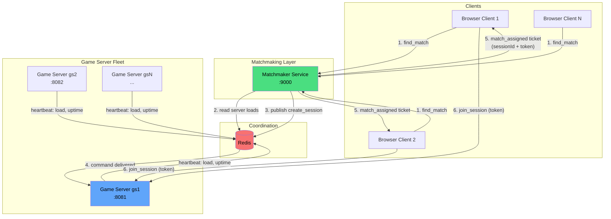
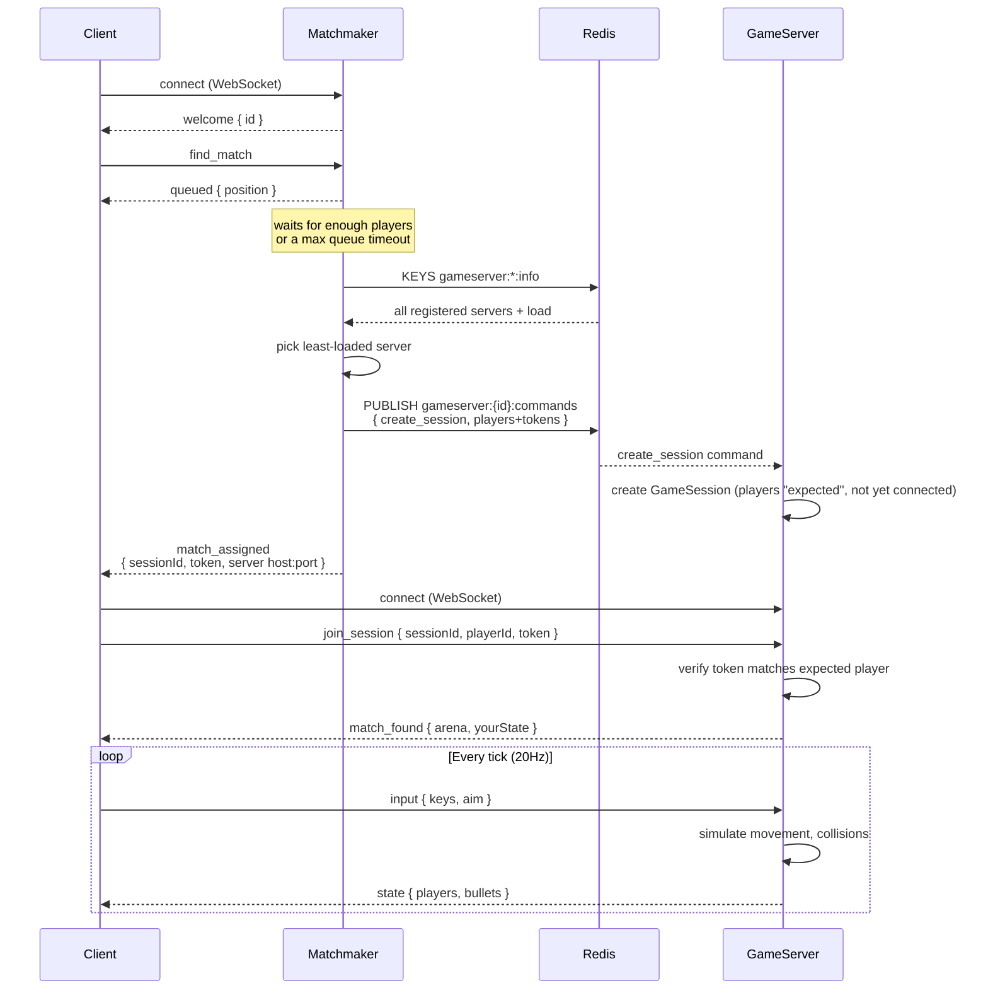
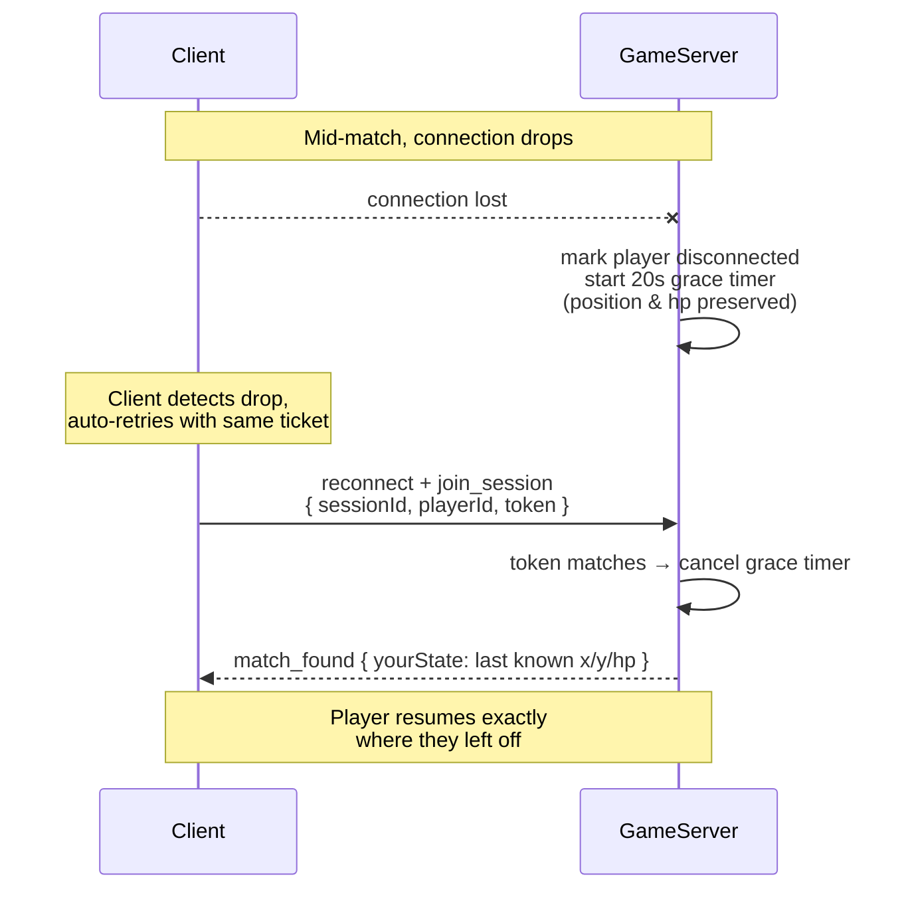

Website-https://shivamm-15.github.io/nexus/public/index.html

# Nexus 

**A distributed, real-time multiplayer game server** — matchmaking, horizontally-scaled game servers coordinated through Redis, server-side lag compensation, stateful reconnection, and a live observability dashboard, all built from scratch in Node.js.

This isn't a game engine demo. It's a working implementation of the same architectural patterns used by real multiplayer backends: an authoritative tick-based simulation, a matchmaker decoupled from game-hosting, service discovery via heartbeats, and hitscan lag compensation using position history.

---

## Why this exists

Most portfolio backend projects are CRUD apps with a database. This one instead tackles problems that only show up in **real-time, stateful, horizontally-scaled systems**:

- How do you keep dozens of players' state in sync 20 times a second without every client seeing a different world?
- How do you spread load across multiple server processes that don't know about each other?
- What happens to a player's game state when their WiFi drops for five seconds?
- How do you make a shot feel fair when the shooter and target both have different, non-zero network latency?

Each of those questions maps to a specific, working piece of this codebase.

---

## Architecture



**The key idea**: the matchmaker and game servers are completely independent processes that never call each other directly. Redis is the only thing they share — heartbeats for service discovery, pub/sub for dispatching new matches. This is what makes it possible to run any number of game server instances, on any number of machines, without changing a line of matchmaking code.

### Connection flow in detail



### Reconnection flow



---

## Features

| Feature | What it demonstrates |
|---|---|
| **Authoritative tick-based simulation** | Server runs a fixed 20Hz loop; clients only ever send *intent*, never move themselves — prevents basic cheating |
| **Client-side prediction + reconciliation** | Your own movement renders instantly instead of waiting a network round trip, then quietly self-corrects against the server's truth |
| **Matchmaking decoupled from game hosting** | Two independently scalable process types coordinating only through shared state |
| **Redis-backed service discovery** | Game servers register themselves via TTL heartbeats — no manual configuration, dead instances disappear automatically |
| **Load-aware match assignment** | New matches go to whichever instance has the fewest players — see "A real bug I found" below |
| **Stateful reconnection** | A dropped connection doesn't end your match — your slot is held for a grace period and resumed via a secret token |
| **Server-side lag compensation** | A hitscan weapon rewinds target positions using a rolling history buffer, so shots register fairly regardless of either player's latency |
| **Scoring + kill feed** | Eliminations are tracked authoritatively, broadcast live, and respawn the eliminated player |
| **Observability dashboard** | Every process exposes its own `/metrics` endpoint (load, tick timing, queue depth), polled live by a zero-dependency dashboard |
| **Load testing** | A script that spins up dozens of simulated concurrent players and reports real connection/matchmaking/latency numbers |

---

## Tech stack

- **Node.js** + **ws** — WebSocket server and client transport
- **Redis** — cross-process coordination (heartbeats + pub/sub), via the official `redis` npm client
- **Vanilla JS + Canvas** — client rendering, deliberately dependency-free
- **No framework** on the server — plain Node so every line of the architecture is visible, not hidden behind a framework's conventions

---

## Getting started

### Prerequisites
- Node.js 18+
- Redis (or a Redis-protocol-compatible server — [Memurai](https://www.memurai.com) works fine on Windows without WSL/Docker)

### Install
```bash
npm install
```

### Run (3 terminals)
```bash
# Terminal 1 — first game server instance
node server/gameServerProcess.js --id gs1 --port 8081

# Terminal 2 — second game server instance
node server/gameServerProcess.js --id gs2 --port 8082

# Terminal 3 — matchmaker
node server/matchmakerService.js
```

Open `public/index.html` in 2–4 browser tabs and click **Find Match** in each.

### Optional: live dashboard
Open `public/dashboard.html` directly in a browser while the above is running — no build step, no server needed for the dashboard itself.

### Optional: load test
```bash
node loadtest/loadtest.js --players 40 --duration 20
```

---

## Load test results (real run, 2 local instances)

```
Simulated players:          12
Distinct sessions formed:   3
Players that finished ok:   12/12
Errors:                     0
Matchmaker connect time (ms):  avg 6    p95 47
Time queued -> matched (ms):   avg 622  p95 1069
Input -> next state RTT (ms):  avg 33   p95 50
```

## A real bug this project's load test caught

An early version of the matchmaker picked the least-loaded server by reading Redis directly. Under rapid match formation (several matches within the same ~1s window), heartbeats hadn't refreshed yet, so the matchmaker kept seeing the *same stale load value* for a server it had just assigned players to — and dumped every subsequent match onto it.

**Fix**: the matchmaker now tracks its own recent assignments locally and adds them on top of the last known Redis value, clearing that local override only once a heartbeat arrives that's fresh enough to already reflect it. This is a textbook eventually-consistent-data-causes-bad-scheduling-decisions bug, and finding it via load testing (rather than by inspection) is exactly why the load test script exists.

---

## Project structure

```
├── server/
│   ├── matchmakerService.js   # Standalone matchmaker process
│   ├── gameServerProcess.js   # A single game server instance (run many of these)
│   ├── gameSession.js         # One isolated match: simulation, lag comp, scoring
│   └── redisClient.js         # Shared Redis connection helper
├── public/
│   ├── index.html             # Game client (canvas rendering, prediction, input)
│   └── dashboard.html         # Live observability dashboard
├── loadtest/
│   └── loadtest.js            # Simulated concurrent players + performance report
└── package.json
```

---

## Known limitations / what I'd improve next

- Server discovery uses Redis `KEYS` pattern matching — fine at this scale, but a Sorted Set would be the production-correct choice for O(log n) selection instead of a full scan.
- No region-awareness in matchmaking — assignment is purely load-based, not latency-based.
- No authentication — players are anonymous numeric IDs.
- Not containerized yet — each process is started manually; a Docker Compose setup is the natural next step.
- No automated test suite yet — correctness was verified via targeted integration scripts during development (visible in the commit history / can be reintroduced as real tests).

---

## Development notes

This was built incrementally: a single-process authoritative server first, then matchmaking and isolated sessions, then the distributed multi-process architecture with Redis coordination and reconnection, then lag compensation, observability, and load testing. Each stage was verified end-to-end (including with real browser clients and simulated concurrent load) before moving to the next, rather than designed all at once on paper.
